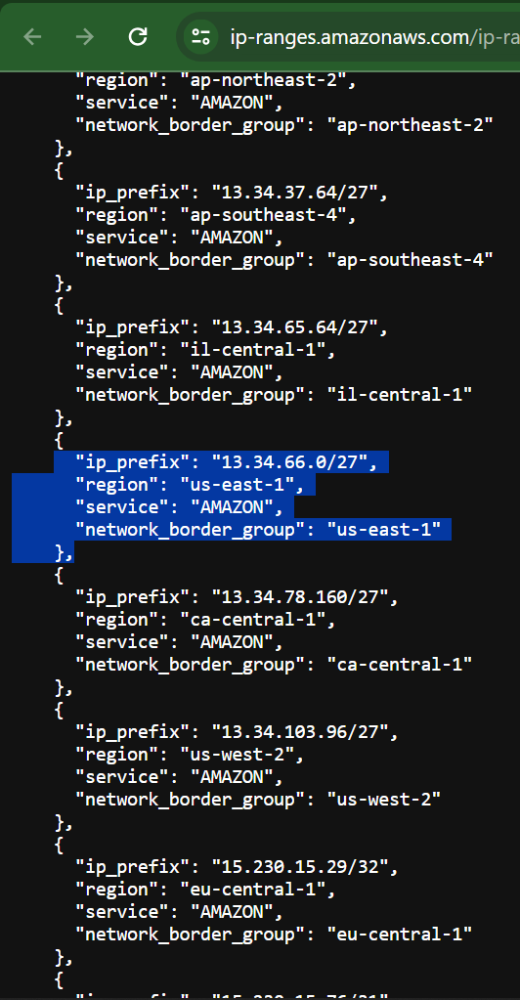

## Task 1: Find the CIDR range for the Instance Connect service

Choose the following link to open the JSON file that provides the IP address ranges for AWS services.

```
AWS services IP ranges
```

Search the file for the EC2_INSTANCE_CONNECT entries, and stop when you find the entry for the us-east-1 region.

    Hint: You can use either the browser menu or ctrl F (for Mac, use command F) to open the search box.

The entry will be similar to the following example:

     "ip_prefix": "18.206.107.24/29",
       "region": "us-east-1",
       "service": "EC2_INSTANCE_CONNECT",
       "network_border_group": "us-east-1"
     },

Copy the ip_prefix value for the EC2_INSTANCE_CONNECT entry.


